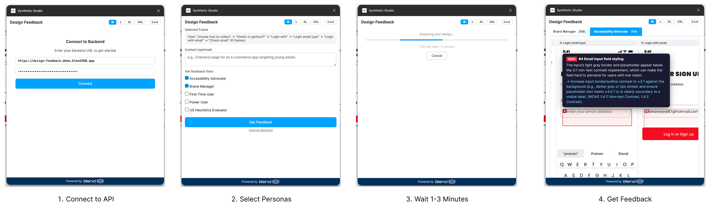

# Synthetic Studio

A Figma plugin that sends design screenshots to AI personas for instant, multi-perspective design feedback. Select frames in Figma, pick reviewer personas (e.g., "First-Time User", "Accessibility Advocate"), and get structured feedback with annotated issue overlays streamed back in real time.



## Getting Started

### Install the Plugin

1. Open **Figma Desktop** (the browser version won't work)
2. Open any design file
3. Click the **Figma menu** (top-left logo) > **Plugins** > **Development** > **Import plugin from manifest...**
4. Navigate to this repo's `figma-plugin/` folder and select **manifest.json**

### Use the Plugin

1. Start the backend (see [Local Development](#local-development) below)
2. Right-click on the canvas > **Plugins** > **Development** > **Synthetic Studio**
3. Enter the backend URL and click **Connect**
4. Select one or more frames, choose which AI personas you want feedback from
5. Click **Get Feedback** — results stream in as each persona finishes (1-3 minutes total)

The plugin remembers your backend URL and API key between sessions.

## Features

- **5 built-in personas** — First-Time User, Power User, Accessibility Advocate, Brand Manager, UX Heuristics Evaluator
- **Annotation overlays** — issues are pinned to specific regions of the design with severity-colored bounding boxes
- **Multi-frame flow analysis** — select multiple frames to get feedback on the full user journey
- **SSE streaming** — feedback streams in as each persona finishes, no waiting for all to complete
- **Extensible** — add new personas by dropping a JSON file in `personas/`, no code changes needed

## How It Works

The plugin exports selected frames as JPEG screenshots, collects metadata (dimensions, text, colors, components), and sends everything to the backend. The backend runs one pydantic-ai agent per persona, each analyzing the screenshots via the OpenAI vision API (`gpt-5` by default). Results stream back as SSE events with structured feedback (issues, annotations, scores).

Screenshots are preprocessed with a coordinate grid overlay to improve spatial accuracy of annotations. The grid is only visible to the AI model, not in the plugin UI.

## Configuration

| Setting | Where | Default |
|---|---|---|
| Backend URL | Plugin UI | Your backend URL (ngrok or production) |
| API Key | Plugin UI | Required when `API_KEY` env var is set on backend |
| Personas | Plugin UI checkboxes | All 5 selected |
| Designer context | Plugin UI text area | Optional free text |
| `MODEL_NAME` | Backend env var | `openai-responses:gpt-5` |

## Local Development

For running your own instance or contributing to the project.

### Prerequisites

- Python 3.13+, [uv](https://docs.astral.sh/uv/)
- Node.js (for building the plugin TypeScript)
- [ngrok](https://ngrok.com/) (tunnels local backend so Figma can reach it)
- An [OpenAI API key](https://platform.openai.com/api-keys)

### Setup

```bash
git clone <repo-url> && cd synthetic-design-feedback
uv sync                                    # Python dependencies
cd figma-plugin && npm install && cd ..    # Plugin dependencies

cp .env.example .env
# Edit .env and set: OPENAI_API_KEY=sk-...
```

### Run

```bash
# Terminal 1: backend
uv run uvicorn api.main:app --reload --host 0.0.0.0 --port 8000

# Terminal 2: tunnel
ngrok http 8000
# Copy the HTTPS URL into the plugin's Backend URL field
```

For local development, leave the `API_KEY` env var empty to disable authentication.

### Commands

```bash
# Tests
uv run pytest tests/ -v

# Linting & formatting
uv run ruff check api/ tests/
uv run ruff format api/ tests/
uv run ty check api/
cd figma-plugin && npx biome check .

# Build plugin (one-off)
cd figma-plugin && npm run build

# Watch plugin for changes
cd figma-plugin && npm run watch
```

### CI

GitHub Actions runs on every PR and push to `main`: Python lint + type check, pytest with coverage, plugin lint + TypeScript check.

## Project Structure

```
api/
├── main.py                  # FastAPI app, CORS, API key middleware, /health
├── config.py                # pydantic-settings (host, port, model, api_key)
├── agents/
│   └── persona_agent.py     # pydantic-ai agent, inline vision, parallel execution, SSE keepalive
├── models/
│   ├── request.py           # FeedbackRequest, FrameData, DesignMetadata
│   └── response.py          # PersonaFeedback, Issue, Annotation
├── personas/
│   └── definitions.py       # Persona dataclass, JSON loader
└── routers/
    └── feedback.py          # GET /api/personas, POST /api/feedback/stream (SSE)

personas/                    # Persona JSON files (add new ones here)
figma-plugin/                # Figma plugin (TypeScript + HTML)
tests/                       # pytest + pytest-asyncio (pydantic-ai mocked)
Dockerfile                   # Multi-stage build: python:3.13-slim + uv
```

## Deployment

A `Dockerfile` is included for production deployment:

```bash
docker build -t synthetic-studio .
docker run -p 8000:8000 -e OPENAI_API_KEY=sk-... -e API_KEY=your-key synthetic-studio
```

Set `API_KEY` to enable authentication. When deploying, add your production domain to
`figma-plugin/manifest.json` > `networkAccess.allowedDomains`.
